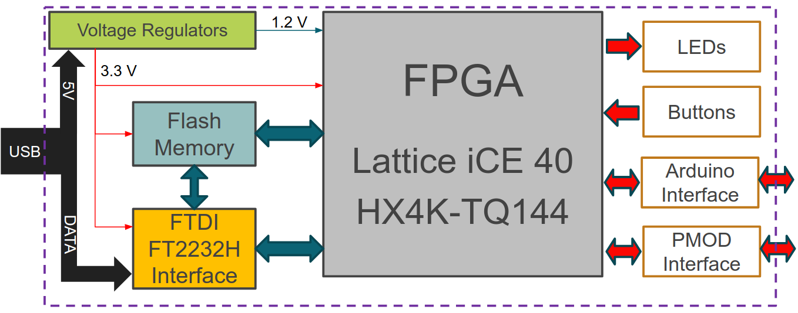

# EDU-CIAA-FPGA

Here you will find KiCad design files, gerber files and documentation for this board developed by Embedded Systems application group from [UTN FR Haedo](http://www.frh.utn.edu.ar/) as part of the [CIAA project](http://www.proyecto-ciaa.com.ar/).
Also you can visit [EDU-CIAA-FPGA Wiki Page](http://www.proyecto-ciaa.com.ar/devwiki/doku.php?id=desarrollo:edu-fpga).

 - [Authors](AUTHORS.md).
 - License: [CIAA Hardware license](LICENSE).

## Introduction
EDU-FPGA is an open source FPGA development board based on [Lattice iCE40HX4K](http://www.latticesemi.com/iCE40), and is part of **FPGA Para Todos** project, which is aimed to bring educational resources for FPGA technologies. EDU-FPGA supports [IceStorm](http://www.clifford.at/icestorm/) open source toolchain and is designed to be a low cost solution for beginners and intermediate students or professionals who wants to start studying FPGA's technologies or deepen their knowledges on this field. Currently, there are two versions of the board: v1.0 and v1.2. The following image shows both:

The board on the right is v1.2 (last version), and it has improvements on smd oscillator, USB footprint, flash memory and push-buttons, to make it more suitable for manufacture. 

More resources and information about **FPGA Para Todos** can be found on project's Wiki [here](https://gitlab.com/RamadrianG/wiki---fpga-para-todos/-/wikis/FPGA-para-Todos).

## Specifications

* Lattice iCE40HX4K FPGA (8K LUT using icestorm toolchain)
* Virtual COM port for debugging and general purpose
* NOR Flash spiFlash, 4M-bit, 4Kb Uniform Sector 
* 4 user push buttons
* 4 user leds
* 2 PMOD 2x6 interfaces
* Similar pinout than Arduino one
* Total 49 I/O pins available for the user
* 12MHz 25ppm -40C +85C clock oscillator
* USB power supply
* 80x60 cm size

### Board Arquitecture

FPGA specifications:

| **Lattice iCE40HX4K TQ144**        |**Specs**|
| ---------------------------------- | ------- |
| Logic cells                        | 3520    |
| 4Kbits Blockrams                   | 20      |
| Phase Locking Loops (PLL)          | 2       |
| DSP slices                         | No      |
| I/O pins                           | 95      |
| Differential I/O pins              | 12      |
| Package                            | TQ144   |
| Price                              | 6 USD   |

## Project directory structure

### Pinout
[Pinout diagram](Pinout/Pinout%20EDU%20FPGA.pdf) of EDU-FPGA v1.2
### Images
Contains images resources for the repository

### Schematic
Here you can find design files, like *.pro, *.sch, *.kicad_pcb. *-cache.lib, *-rescue.lib, footprints lib table, symbols lib table, [schematic.pdf](Schematic/schematic.pdf). Also, under this directory you can find:

#### BOM
[BOM of EDU-FPGA v1.2 ](Schematic/BOM/BOM.ods)

#### footprints.3dshapes
3D shapes of components

#### footprints.pretty
Footprints of all components

#### Gerbers
[Gerbers files of EDU-FPGA v1.2](Schematic/Gerbers)

#### Libraries
Libraries of component's symbols created specifically for the project

#### Panellised
Soon, 4x4 panel of EDU-FPGA v1.2 will be available in this directory.
<!--Here you can also find [Gerbers](Schematic/Panelizado/V1.2/Gerbers) of 4x4 panel.-->

#### Simbolos_EDUFPGA.pretty
Symbols of EDU-FPGA project logo
